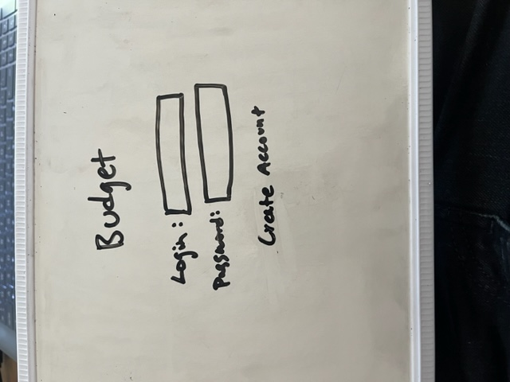
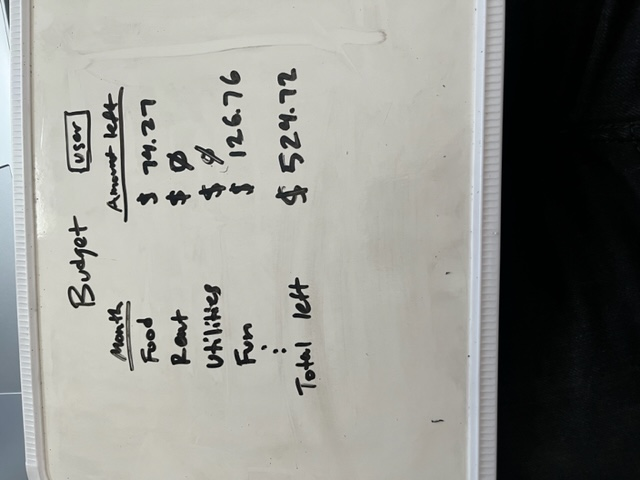
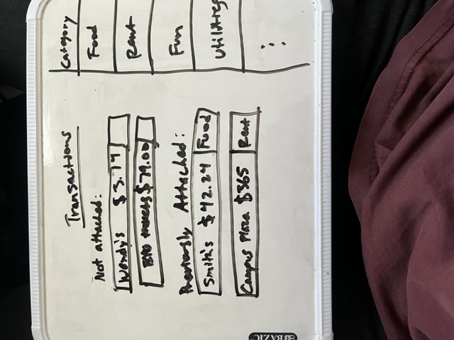

# Budget

## Description deliverable

### Elevator pitch
Do you struggle to budget efficiently? Every month you write out your budget and then hope that you stay under budget? Or you go out with some friends and are stressed about how much money you have left in the budget? Well the Budget application is here to help! Instead of using excel or a sheet of paper and hope that you remember all the categories, the budget app will come with a ideas to include in your budge and ways to customize your budget to fit your needs. How is this different than excel??? The budget app will be able to connect your bank account to your budget and update in real time how much money is left in your budget. All you have to do is drag the charge into the correct category and you are up to date on your budget.

### Design

### Key features
- Each person will need to create an account to securely save their budget
- Each budget will be saved into a database
- The budget will update in real time to include new transactions to be categorized
- Drag and drop transaction transaction functionality
- Complete budget customization ability

### Technologies
**HTML**: 4 HTML pages- 
1. Homepage 
2. Budget
3. Transaction
4. How to budget and ways to save in key areas

**CSS**: Application styling supports user experience with application

**JavaScript**: Provides login, drag and drop, drop down

**Services**: Provides backend support for 
- login
- retrieving bank transaction data
- retrieving budget details
- categorizing transaction data

**DB**: Store users, budgets, API keys, etc.

**Login**: Register new users and login existing users. Credentials are stored securely, can't use budget without authentication

**WebSocket**: Bank transactions are found and added to list of transactions needed to be categorized

**React**: Application is ported to use the React web framework

## HTML deliverable

For this deliverable I built out the structure of my application using HTML.

- HTML pages: Four HTML page that represent the ability to login, create a budget, manage transactions, and created an about page.
- Links: The login page automatically connects to the Budget page. From their the Budget page has links to the Transactions, Login, and About pages. These pages, other than the Login page, all link to each other.
- Text: The Budget page has a table with text in it, the Transaction page has data with transaction data, and the About page has text describing the point of the page.
- Images: Added an image to the About page.
- Login: Input box with a username input and an input box with a password box with a submit button for logging in.
- Database: The Budget holds data being pulled from the transactions tab.
- Websocket- The transaction page brings in transactions in real-time.

## CSS deliverable

For this deliverable I styled the application using CSS.

- Header, footer, and main content body
- Navigation elements: The navigation anchors only are underlined when you hover over the link, the color is changed, and the link bolds when hovering over them as well.
- Responsive to window resizing: The app responds when the window is resized.
- Application elements: Good contrast and use of whitespace.
- Application text content: Fonts are consistent and the fonts don't distract from each other.
- Application images: Image isn't over-stretched and is centered when resized.

